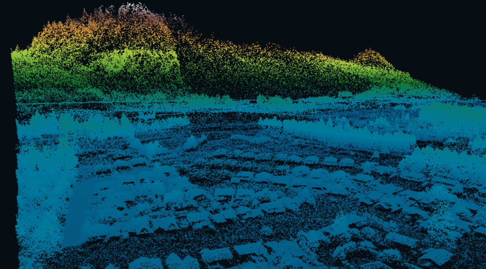
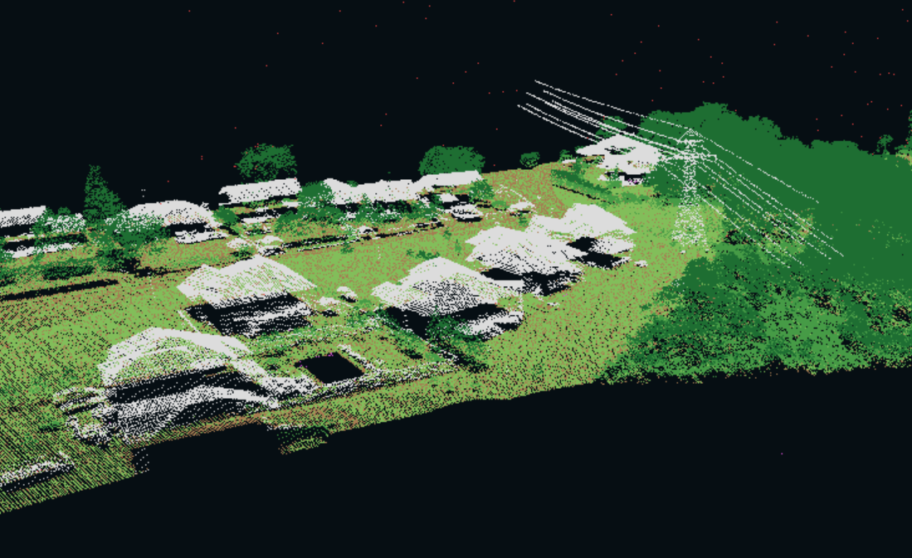

# D3D12 Real-Time LiDAR Renderer

A from-scratch Direct3D 12 point-cloud renderer for exploring large LAS, LAZ, and COPC datasets in real time. The project focuses on the systems behind a practical renderer: GPU resource ownership, spatial level of detail, tile residency, point budgets, culling, and performance measurement.

> Built as a hands-on graphics programming project using C++20, Win32, Direct3D 12, HLSL, CMake, and LASzip.

## Gallery

| Elevation colouring — Hope, British Columbia | Classification colouring — Niagara, Ontario |
|:---:|:---:|
|  |  |

## What it does

- Loads one or more `.las`, `.laz`, or `.copc.laz` files through LASzip.
- Reads point counts, bounds, coordinate systems, classifications, and available attributes.
- Converts large geospatial coordinates into a stable local, Y-up coordinate system.
- Builds a CPU octree-like hierarchy with representative point samples at coarser levels.
- Selects detail using projected point spacing, view-frustum culling, hysteresis, and a global point budget.
- Keeps nearby tiles resident under a configurable GPU point-memory budget.
- Safely retires evicted D3D12 resources after their fence completes.
- Renders classification colours or a terrain-style elevation gradient.
- Displays live FPS, frame time, CPU/GPU timing, point counts, memory usage, tile residency, draw ranges, and culled nodes in the window title.
- Includes a repeatable fixed-view benchmark mode.

## Rendering pipeline


The current COPC path reads the file sequentially through LASzip. Native COPC hierarchy traversal and HTTP range streaming are planned future work.

## Controls

| Input | Action |
|---|---|
| `W` `A` `S` `D` | Move horizontally |
| `Q` / `E` | Move down / up |
| Right mouse drag | Look around |
| Arrow keys | Adjust yaw and pitch |
| `Shift` | Move faster |
| `Ctrl` | Move precisely |
| `R` | Frame the complete dataset |
| `1` | Classification colours |
| `2` | Elevation colours |
| `L` | Toggle budgeted LOD / full detail |
| `B` | Run the fixed-view benchmark |

Full-detail mode intentionally bypasses the global draw budget. Large datasets can overwhelm an integrated GPU in this mode.

## Requirements

- Windows 10 or 11
- A Direct3D 12 capable GPU
- Visual Studio 2022 with **Desktop development with C++**
- Windows 10/11 SDK with `dxc.exe`
- CMake 3.24 or newer
- Ninja or another CMake-supported generator
- Internet access during the first configure so CMake can fetch LASzip 3.5.0

## Build

The easiest route is to open the repository as a CMake folder in Visual Studio 2022 and build the `PointCloudRenderer` target.

From a **Developer PowerShell for Visual Studio 2022** terminal:

```powershell
cmake -S . -B out/build/x64-Release -G Ninja -DCMAKE_BUILD_TYPE=Release
cmake --build out/build/x64-Release
```

For a debug build, replace `x64-Release` and `Release` with `x64-Debug` and `Debug`.

## Run

Pass one or more point-cloud files as command-line arguments:

```powershell
& ".\out\build\x64-Release\PointCloudRenderer.exe" "C:\point-clouds\tile-01.copc.laz" "C:\point-clouds\tile-02.copc.laz"
```

To launch every tile in a folder without PowerShell line-continuation characters:

```powershell
$tiles = @(
    Get-ChildItem "C:\point-clouds\dataset" -Filter "*.laz" -File |
    Sort-Object Name |
    ForEach-Object FullName
)

& ".\out\build\x64-Release\PointCloudRenderer.exe" @tiles
```

Point-cloud datasets are intentionally excluded from the repository because they are often hundreds of megabytes or several gigabytes.

## Current architecture

- **Application:** Win32 lifetime, input, dataset coordination, tile priority, residency, LOD selection, and benchmark state.
- **LAS loader:** metadata inspection, LASzip decoding, coordinate conversion, and classification colours.
- **Hierarchy builder:** spatial subdivision, leaf packing, representative sampling, bounds, and spacing estimates.
- **D3D12 context:** device and swap chain ownership, frames in flight, vertex buffers, uploads, fence-safe retirement, timing queries, and drawing.
- **HLSL shader:** camera transformation plus classification or elevation colouring.

## Current limitations

- Tile decoding, hierarchy construction, and upload currently happen synchronously on the render thread. A newly requested large tile can cause a visible frame-time spike.
- GPU uploads currently wait for the graphics queue before and after copying a tile.
- COPC files are decoded as ordinary LAZ files; the internal COPC hierarchy is not yet used for partial loading.
- The hierarchy is rebuilt when a tile is loaded instead of being cached on disk.
- The renderer currently targets Windows and Direct3D 12.

These limitations define the next development steps: asynchronous CPU loading, nonblocking copy-queue uploads, native COPC streaming, and research-inspired continuous LOD selection.

## Dataset note

The screenshots use Canadian public LiDAR data. Dataset files are not redistributed in this repository.
